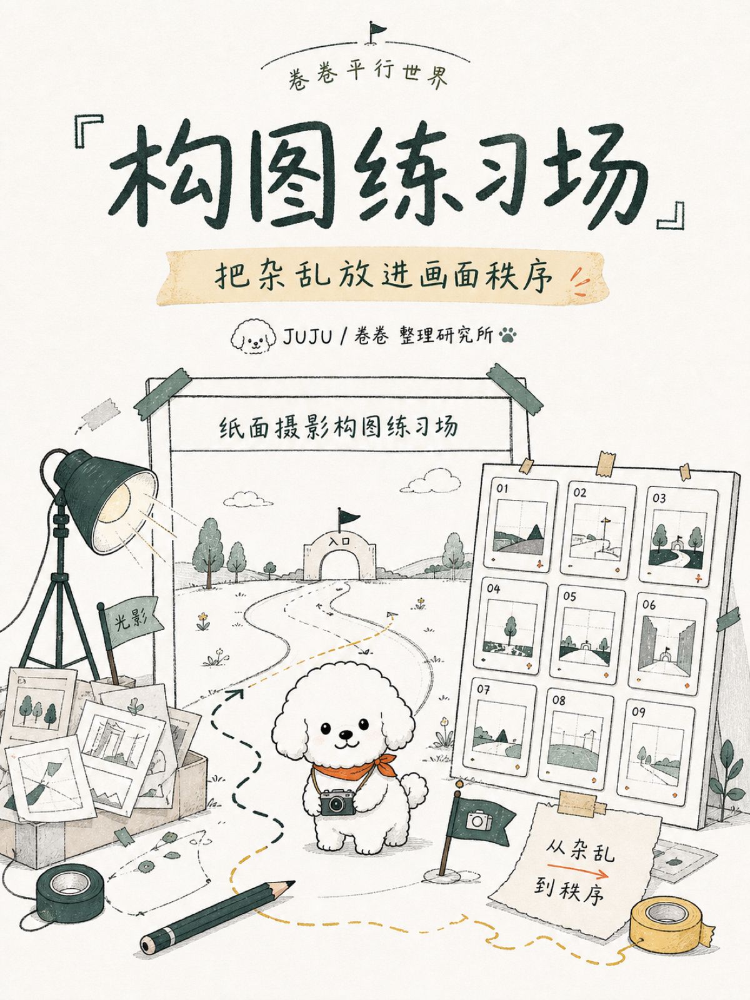
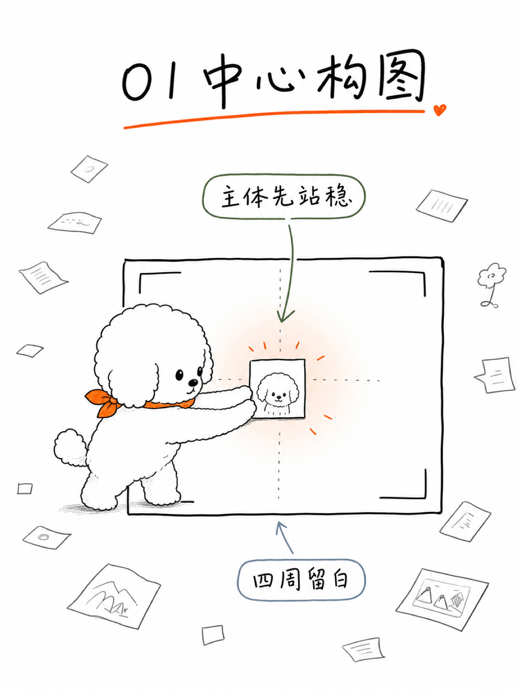
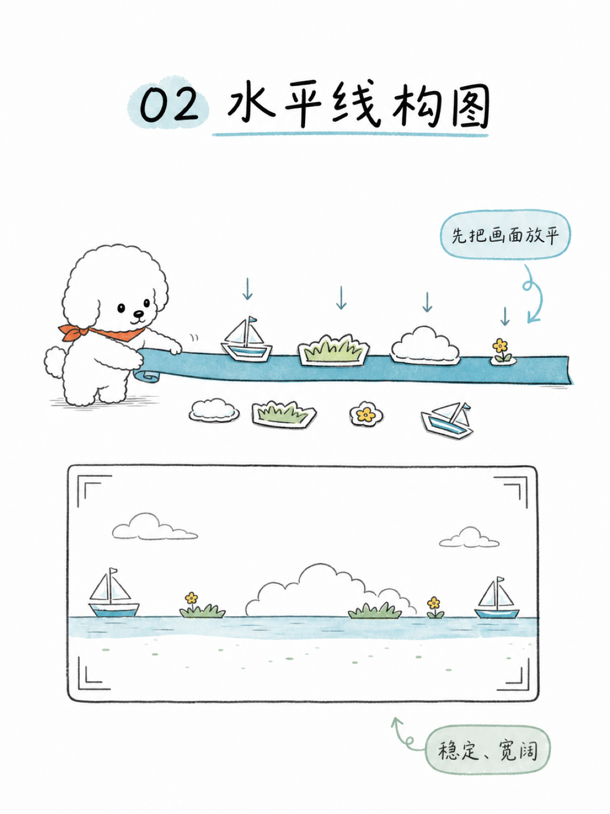
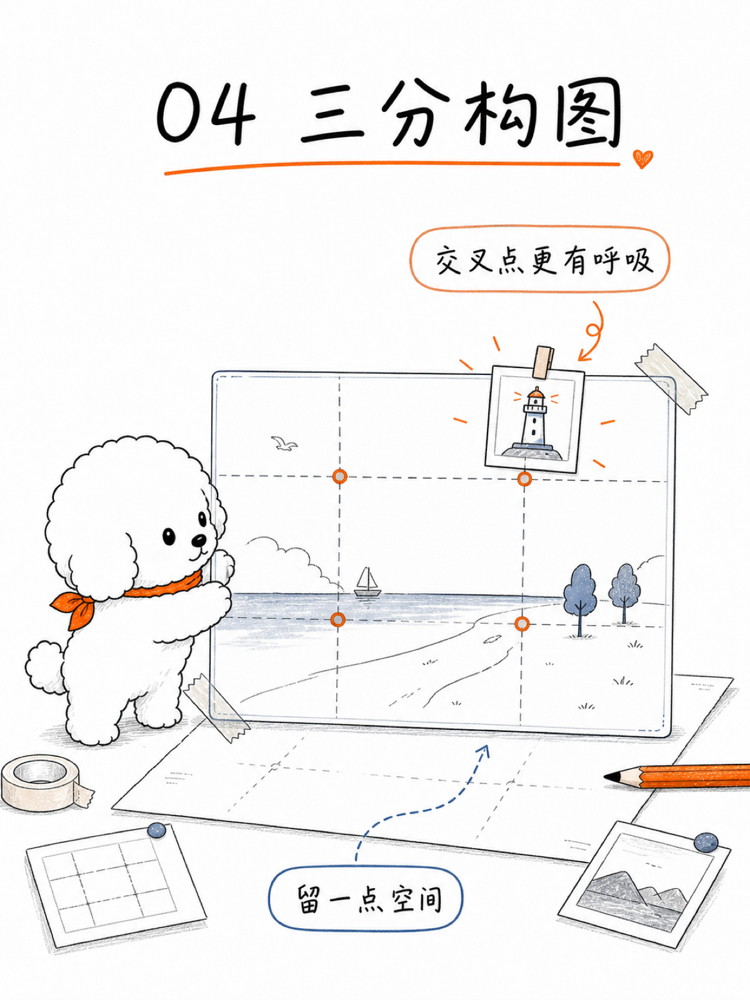
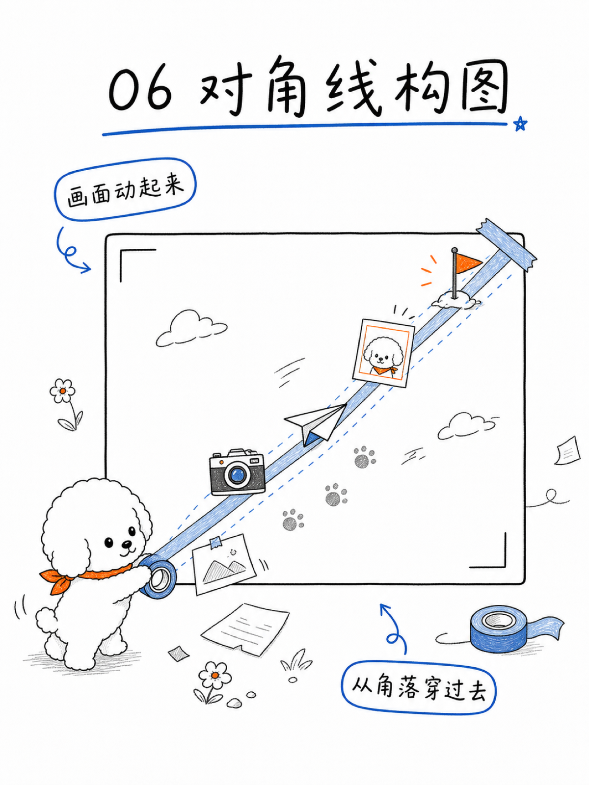
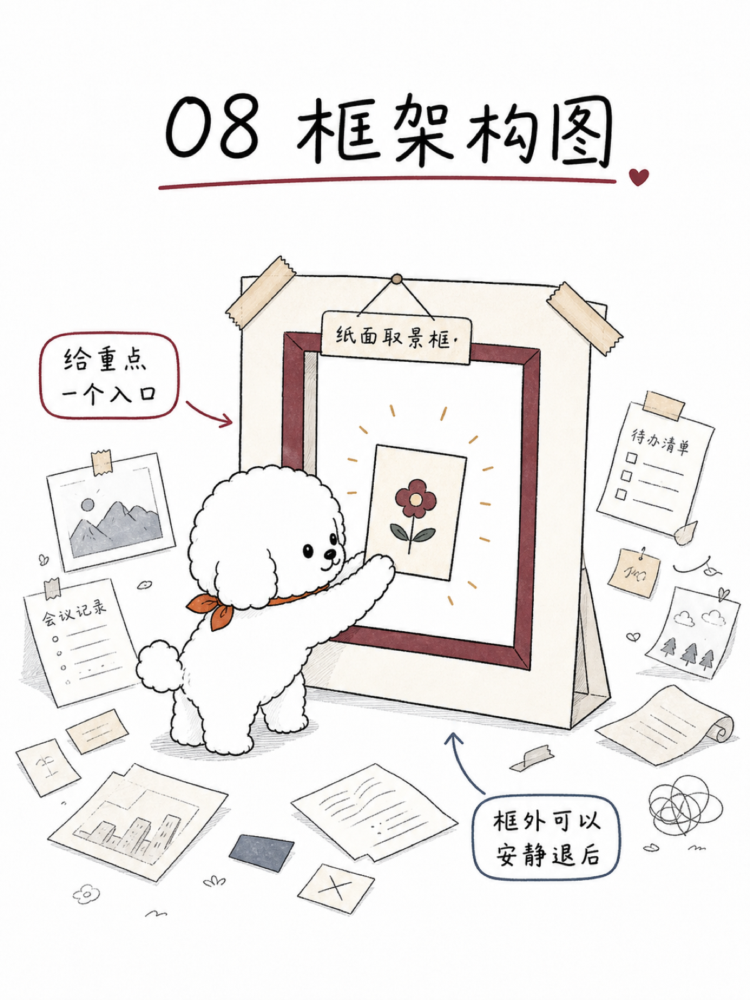
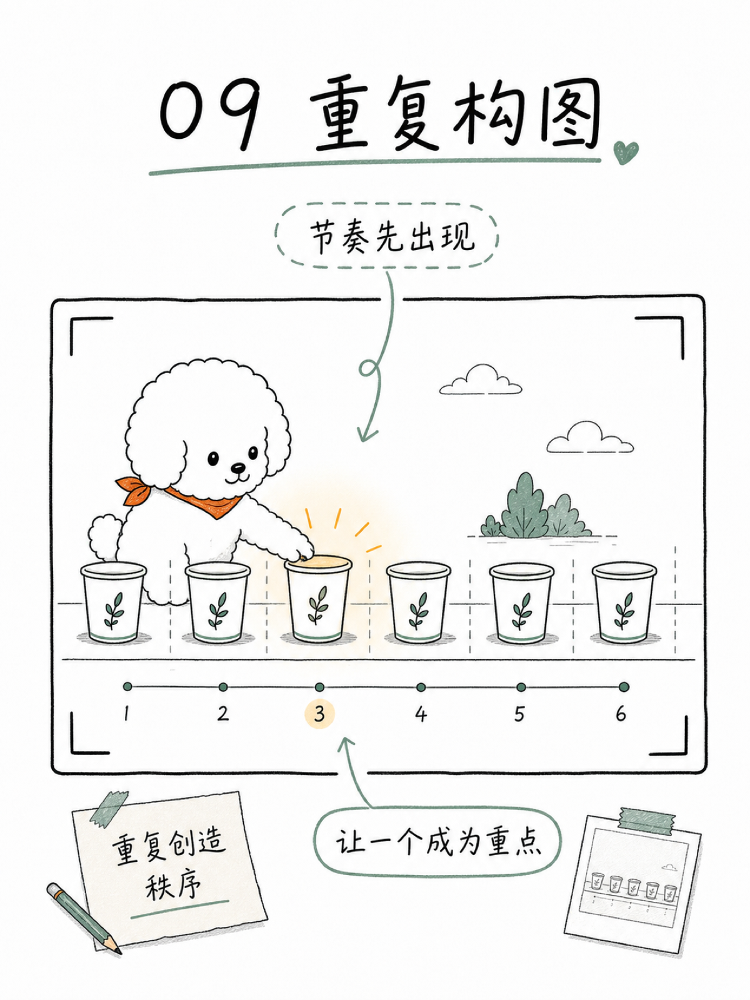

# 卷卷整理研究所：内容插画 Skill

卷卷不是让你更卷。卷卷是帮你少内耗。

把文章、观点、教程和复盘，整理成清晰、可开始、可收藏、可复用的手绘视觉方法图。

卷卷是一只白色比熊复杂问题整理师。它不是宠物头像，也不是治愈小狗贴纸；它会在一个纸面平行世界里执行整理动作：圈出关键、拆开关系、照亮路径，把松散内容变成读者能进入的视觉现场。

## 示例

这是一组摄影构图教程示例：1 张封面 + 9 张正文图。封面建立“构图练习场”的平行世界入口，正文每张只讲一个构图动作。

示例图用于校准“白底纸面、轻线稿、卷卷动作、低饱和主题色、平行世界”的整体感觉，不是构图模板。真正使用时，Skill 会从你的内容重新发明隐喻、道具和画面关系。

<p align="center">
  
</p>

<p align="center">
  
  &nbsp;&nbsp;
  
  &nbsp;&nbsp;
  
</p>

<p align="center">
  <sub>中心构图 · 水平线构图 · 三分构图</sub>
</p>

<p align="center">
  
  &nbsp;&nbsp;
  
  &nbsp;&nbsp;
  
</p>

<p align="center">
  <sub>对角线构图 · 框架构图 · 重复构图</sub>
</p>

完整 10 张示例图在 `juju-content-illustrations/assets/examples/composition-3x4/`。

## 它能做什么

- 把长文、教程、产品说明、技术复盘、方法论内容转成卷卷风格图片。
- 生成一张强观点图，或一组封面 + 正文套图。
- 帮你把内容拆成标题、画面动作、低技术隐喻、中文标注和生图 prompts。
- 根据内容基调选择主题色、平行世界和整体氛围。
- 配合当前 Agent 已接入的生图能力使用；不能直接生图时，会给出可复制的 prompts。

## 你会得到什么

- 如果当前环境可以直接生图，你会得到一张或一套卷卷风格图片。
- 如果当前环境不能直接生图，你会得到成套 prompts，可以复制到自己的图像工具中使用。
- 如果是套图，封面负责入口、记忆点和整体世界；正文图负责拆解不同关键点，不重复封面构图。
- 这个公开包包含可安装 Skill、视觉规则、输出比例、prompt 模板和示例资产，不包含私有项目资料。

## 适合谁

- 写公众号、X 长文、小红书方法卡或知识型内容的人。
- 想把复杂文章转成原创视觉图，而不是套信息图模板的人。
- 做 AI、产品、摄影、学习、复盘、教程、非虚构写作的人。
- 需要稳定视觉系统，但不想每次从零设计的人。
- 想让内容更容易被读懂、保存和再次使用的人。

不适合：

- 宠物写真。
- 纯治愈小狗插画。
- PPT 模板化信息图。
- 只想复制某张旧图构图的场景。

## 视觉风格

卷卷内容插画的核心不是“可爱”，而是“把问题整理到一个能进入的现场”。

- 白底或近白纸面。
- 黑色轻手绘线稿。
- 低饱和主题色，按内容切换。
- 卷卷必须像白色比熊：黑眼睛、黑鼻子、清楚眼鼻三角、下垂耳朵、短腿和小狗比例。
- 每张图只讲一个认知动作。
- 中文文字要嵌入画面，像标题、标签、便签、箭头和纸片，不做后贴字幕。
- 画面可以有世界感，但不能让道具和氛围抢走内容判断。

## 平行世界

卷卷会把内容带进一个低技术、可触摸的纸面世界。常见世界包括：

- 纸面摄影练习场。
- 方法整理桌。
- 路径地图。
- 小型档案室。
- 工具盒和工作台。
- 情绪天气房。
- 复盘修理铺。

平行世界不是固定模板。每篇文章都要从内容重新发明隐喻。

## 使用流程

安装后，你可以这样叫它：

```text
调用卷卷整理研究所 Skill 帮我生图
```

也可以说：

```text
帮我把这篇文章生成 卷卷整理研究所风格图
生成一组卷卷风格图片
用卷卷整理研究所把这段内容整理成插画
```

Skill 启动后会先问：

```text
这次需要做什么？请把你的文章或内容复制给我。
```

收到内容后，它会问你选择输出目标：

```text
请选择图片比例 / 平台：

1. 16:9，1600 x 900：X 正文图、公众号头图、公众号正文图、技术复盘图
2. 5:2，1600 x 640：X 封面图、X 长文入口图
3. 3:4，1200 x 1600：小红书正文方法卡、收藏卡、课程型套图
4. 1:1，1200 x 1200：社媒方图
5. 4:5，1440 x 1800：社媒竖图、封面
6. 9:16，1080 x 1920：竖屏封面、故事图
```

你不需要先决定要几张图。Skill 会根据内容密度判断更适合单图、短套图，还是 1 张封面 + 多张正文图；一次最多 10 张。

如果当前环境可以生图，它会继续生成图片；如果不能直接生图，它会输出完整 prompts，方便你复制到自己的图像工具里使用。

## 安装

最简单的方法：

```text
请把这个仓库里的 juju-content-illustrations 安装成可用 Skill。
```

如果你的 Agent 支持读取本地 Skill，直接把上面这句话交给它即可。

手动安装方式：

把 `juju-content-illustrations/` 目录放进你的 Agent skills 目录。

示例：

```bash
mkdir -p ~/.codex/skills
cp -R juju-content-illustrations ~/.codex/skills/
```

其他本地 Agent：

- 让 Agent 能读取 `juju-content-illustrations/SKILL.md`。
- 确认它能访问 `references/`、`examples/` 和 `assets/examples/`。
- 如果它不能直接生图，就让 Skill 输出 prompts。

## 目录结构

```text
juju-content-illustrations/
├── SKILL.md
├── references/
│   ├── style-dna.md
│   ├── output-formats.md
│   ├── workflow.md
│   ├── prompt-template.md
│   └── qa-checklist.md
├── examples/
│   └── composition-3x4-suite.md
└── assets/
    └── examples/
        └── composition-3x4/
            ├── composition-cover.png
            ├── composition-01-center.png
            └── ...
```

## FAQ

**它会自动决定生成几张吗？**  
会。用户只需要提供内容和目标比例。Skill 会根据内容密度决定单图、短套图，或封面 + 多张正文图。一次最多 10 张。

**我能指定“必须 9 张”吗？**  
可以，但不建议。卷卷的核心能力是根据内容决定图片数量。强行指定数量可能让画面变水。

**支持哪些比例？**  
支持 16:9、5:2、3:4、1:1、4:5、9:16。默认优先 16:9、5:2 和 3:4。

**需要绑定某个图像模型吗？**  
不需要。能直接生图就直接生图；不能直接生图时，先输出可复制的生成 prompts。

**可以商用吗？**  
请查看本仓库的 License。示例图和提示词用于展示 Skill 能力，正式商业使用时请自行确认所用图像模型和内容来源的授权。

**输入什么内容效果最好？**
完整文章、教程、复盘、观点草稿、产品说明都可以。最好同时给出目标读者和发布平台；如果只给一句话，Skill 也能做，但会更偏单张观点图。

**示例图可以直接复用吗？**
示例图可以用来理解风格，不建议直接复用构图。卷卷整理研究所更适合为每篇内容重新设计平行世界。

## 关于作者

爆裂队长NEXT

15yr PM. Fired myself. Hired 10 AIs. Turns out managing AIs is harder than managing humans.

AI Agents BLTeam 翻车笔记。真实战，生产级真干货持续分享。少刷二手情绪，多看一手信号源。

X/Twitter: [@thinkszyg](https://x.com/thinkszyg)

邮箱: blteam2026@outlook.com

## License

MIT。详见 `LICENSE`。
